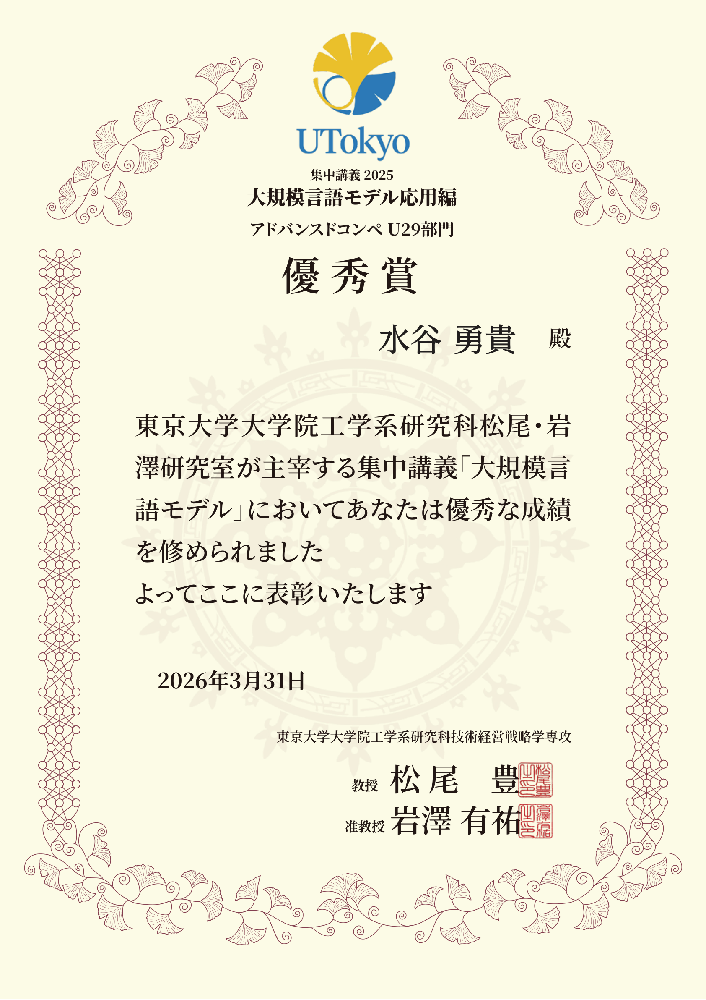

# 松尾研 LLM Advanced Competition 公開用スナップショット

東京大学 松尾・岩澤研究室の集中講義「大規模言語モデル応用編」アドバンスドコンペ U29 部門で優秀賞を受賞した取り組みの、採用・技術面接向け公開用スナップショットです。

このプロジェクトでは、DBBench と ALFWorld という 2 種類の agent benchmark に対して、`Qwen2.5-7B-Instruct` を SFT / LoRA / QLoRA で追加学習し、総合スコア改善を狙いました。中心となる工夫は、ALFWorld の function-calling trajectory を text ReAct 形式へ変換し、DBBench と近い会話形式にそろえたうえで hybrid SFT を行った点です。

この repo には、公開可能な実験ログ、主要 script、短い技術解説、runbook、受賞証明のみを含めています。raw dataset、model artifact、credential、巨大 log、notebook 出力は含めていません。

## 成果サマリ

最良 run は `hybrid_alf_react` です。

| 実験 | ALFWorld | DBBench | Combined | Submission Score |
|---|---:|---:|---:|---:|
| Baseline, no SFT | 48.0% | 51.0% | 99.0 | - |
| DB-only low-impact SFT | 56.0% | 52.405% | 108.405 | 4.1694 |
| Hybrid ALF ReAct SFT | 64.0% | 48.806% | 112.806 | 4.3387 |
| Hybrid ALF ReAct + MAX x2 | 64.0% | 48.715% | 112.715 | 4.3352 |

最終方針は、DBBench 単体のスコア最大化ではなく、agent としての総合性能を優先することでした。`hybrid_alf_react` では baseline に対して ALFWorld が 16.0pt 改善し、DBBench の低下を許容範囲に抑えたことで combined score を改善しました。

## 何を作ったか

- DB-only / hybrid run を切り替えられる SFT 学習 script
- DBBench の `agent` role を `assistant` にそろえる正規化処理
- SQL 末尾に不要な `))` を含む既知の不良サンプルの除外
- ALFWorld の function-calling action を text ReAct 形式へ変換する前処理
- 最終実験の runbook と実験ログ
- ALFWorld の形式比較、DBBench の error analysis 用 script

## 読む順番

1. [`experiment_log.md`](experiment_log.md): 実験ごとのスコア推移と判断理由
2. [`docs/technical-notes.md`](docs/technical-notes.md): 中核となる形式統一アプローチの短い説明
3. [`final_three_experiments_runbook.md`](final_three_experiments_runbook.md): 最終 3 実験の profile と実行順
4. [`standard_code_sft_v2.py`](standard_code_sft_v2.py): main training script
5. [`merge_and_upload.py`](merge_and_upload.py): sanitized 済みの model merge / upload helper

## Repo 構成

- `standard_code_sft_v2.py`: profile switching 付きの Colab 向け SFT script
- `merge_and_upload.py`: 環境変数ベースの LoRA adapter merge / upload helper
- `extract_format_evidence.py`: ALFWorld の形式比較用 local log inspection helper
- `analyze_v4_errors.py`: DBBench の task-limit error 分析 helper
- `experiment_log.md`: 実験履歴と score progression
- `score_improvement_plan.md`: 初期の改善方針
- `final_three_experiments_runbook.md`: 最終実験の profile と実行順
- `docs/development_document_simple_draft.md`: 日本語の短い開発メモ
- `docs/technical-notes.md`: 技術面接向けの短い解説
- `docs/evidence/`: 受賞証明 PDF と README 表示用 preview

## 受賞と根拠

- 受賞: 松尾研 LLM 講座 Advanced Competition U29 部門 優秀賞
- 公式講座情報: [東京大学 松尾・岩澤研究室 大規模言語モデル講座](https://weblab.t.u-tokyo.ac.jp/lecture/course-list/large-language-model/)
- 公式掲載: [松尾研講座 Notion ページ「大規模言語モデル2025」欄](https://matsuolab-lecture.notion.site/432e287af97445d5aba989553ebaf808#126cfa7cece780d0807cea09481a604c)
- 証明書 PDF: [`docs/evidence/matsuo-llm-advanced-u29-award-certificate.pdf`](docs/evidence/matsuo-llm-advanced-u29-award-certificate.pdf)

## 意図的に除外しているもの

この repo には以下を含めていません。

- API token、Hugging Face token、local `.env`
- model checkpoint、LoRA adapter export、merged model weight
- private submission credential
- raw dataset や再配布可否が不明なデータ
- generated cache、notebook output、巨大 log

## 再現性について

この repo は、当時の実験設計・改善過程・主要な実装意図を説明するための公開用 snapshot です。元の competition environment、model artifact、local log、一部の data access 前提は公開対象から外しているため、完全な one-command reproduction package ではありません。
